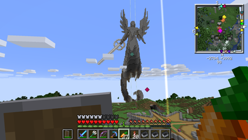

<link rel="stylesheet" type="text/css" media="all" href="index.css" />

# Minecraft Server (1.13.2)

Welcome to the **xjcl.online** Minecraft server!

There are **(loading...)** players online right now!

Maps of the server:

Sights:

Join by asking to be put on the [whitelist](whitelist.json) and the connecting to the address **xjcl.online** using **Minecraft 1.13.2**.
